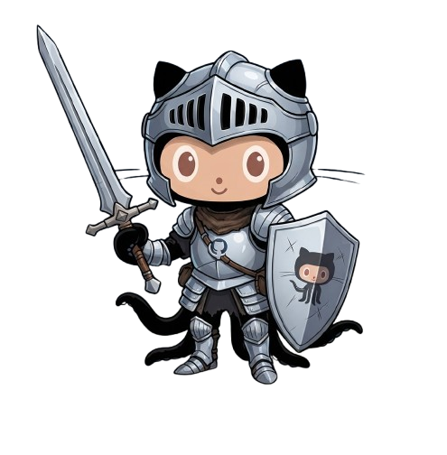

<h1 align="center">GitSouls</h1>

> Turn your profile into a Souls-like boss.

<p align="center">
  
</p>


<h2 align="left">🔥 Summon your Soul</h2>
Your GitSouls summoned at URL.</br>
Drop it in your profile README, your portfolio, blog, community.

```[](https://gitsouls.com/YOUR_USERNAME)```

| Resource | Description |
|---|---|
| gitsouls.com/<username>.png | live boss card |
| gitsouls.com/<username> | boss profile |


---

⚙️ How stats work

|  | Stat | Taken from |
|---|---|---|
| VIT | vitality | Total contributions, Commit count, Activity history, etc... |
| END | endurance | Contribution streak, Active months, Activity consistency, etc... |
| INT | intelligence | Languages used number, stack differences, quality repos, etc... |
| DEX | dexterity | Number of repos, creation repos frequency, commits number, etc... |
| FAI | faith | Open source repos, forks, public PR, etc... |
| SOP | soul power | Followers, stars, watchers, etc... |

```Formula: (VIT+END+INT+DEX+FAI+SOP)/6```

⚔️ Boss Ranking System


🧙🏼‍♂️ Class System


