<h1 align="center"><a href="https://gitsouls.com">GitSouls</a></h1>

> Turn your profile into a Souls-like boss.

<p align="center">
  
</p>

> Summon your pixel-ego

<p align="center">
  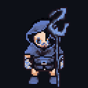
  &nbsp;&nbsp;
  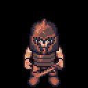
  &nbsp;&nbsp;
  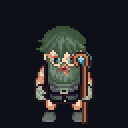
  &nbsp;&nbsp;
  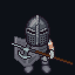
  &nbsp;&nbsp;
  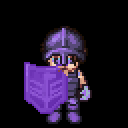
  &nbsp;&nbsp;
  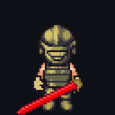
</p>

<p align="center">
  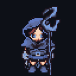
  &nbsp;&nbsp;
  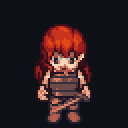
  &nbsp;&nbsp;
  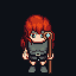
  &nbsp;&nbsp;
  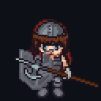
  &nbsp;&nbsp;
  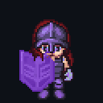
  &nbsp;&nbsp;
  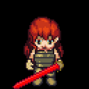
</p>


<h2 align="left">🔥 Summon your Soul</h2>
Your GitSouls summoned at URL.</br>
Drop it in your profile README, your portfolio, blog, community.

```[](https://gitsouls.com/YOUR_USERNAME)```

| Resource | Description |
|---|---|
| ```gitsouls.com/<username>``` | boss profile |
| ```gitsouls.com/<username>/card.png``` | shareable boss card, 1080×1920 (story format) |
| ```gitsouls.com/<username>/vs/<opponent>``` | duel between two bosses |


---
<h2 align="left">⚙️ How it works</h2>

|  | Stat | Taken from |
|---|---|---|
| VIT | vitality | Total contributions, Commit count, Activity history, etc... |
| END | endurance | Contribution streak, Active months, Activity consistency, etc... |
| INT | intelligence | Languages used number, stack differences, quality repos, etc... |
| DEX | dexterity | Number of repos, creation repos frequency, commits number, etc... |
| FAI | faith | Open source repos, forks, public PR, etc... |
| SOP | soul power | Followers, stars, watchers, etc... |

```Formula: (VIT+END+INT+DEX+FAI+SOP)/6```

⚔️ Boss Ranking System - based on overall stats


🧙🏼‍♂️ Class System - based on your highest stat


🗡️ Duel System - two bosses, one arena

Pit any two profiles against each other at ```gitsouls.com/<you>/vs/<them>```, or
from the **Duel** button on any profile.

| | How it works |
|---|---|
| **Battle power** | Overall power **+** the summed weight of every unlocked skill. Highest total wins — so a deeper skill roster can take a fight that raw stats alone would lose. |
| **Skills** | Each unlocked skill carries a weight of 1–5; rarer conditions weigh more. |
| **Health** | The victor keeps the share of their power the loser could not answer. A near-equal opponent leaves them at a sliver; a far weaker one barely scratches them. |
| **Tie** | Equal battle power means neither survives. |
| **The tale** | Written from both fighters — their ranks, classes, and the skills they lean on. |

```Battle power: (VIT+END+INT+DEX+FAI+SOP)/6 + Σ(skill weights)```


